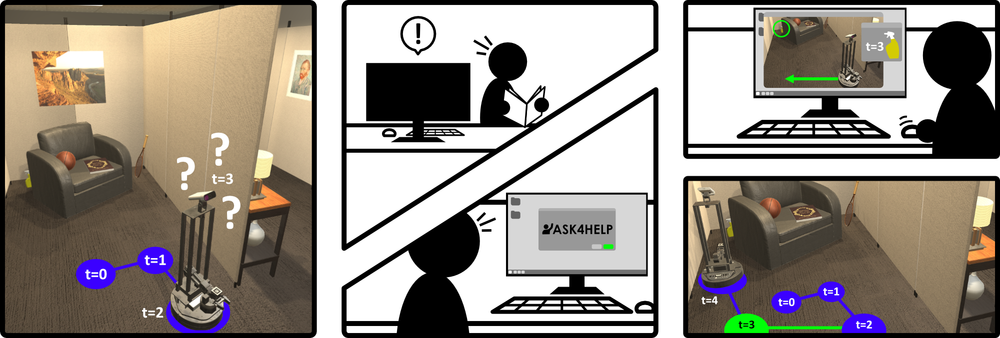

## [Ask4Help: Learning to Leverage an Expert for Embodied Tasks]()

By [Kunal Pratap Singh](https://kunalmessi10.github.io/), [Luca Weihs](https://lucaweihs.github.io/), [Alvaro Herrasti](https://scholar.google.com/citations?user=89Knd5YAAAAJ&hl=en), [Jonghyun Choi](https://ppolon.github.io/), [Aniruddha Kembhavi](https://anikem.github.io/), [Roozbeh Mottaghi](https://roozbehm.info/)

[Paper]() | [BibTex](#citation) | [Talk](https://recorder-v3.slideslive.com/?share=75288&s=b604cd5a-0b22-4f7b-b4bc-1b5779be827b)


This is the official code base for our paper presented in Neurips, 2022.



### Installations

1. Clone this repository

```
   git clone https://github.com/allenai/ask4help.git
```
2. Install the requirements in virtual environment using the following commands
```
   pip install -r requirements.txt
   pip install -r dev_requirements.txt
   pip install -r allenact_plugins/ithor_plugin/extra_requirements.txt
   pip install -r allenact_plugins/robothor_plugin/extra_requirements.txt
```

3. You will require `xorg` on your machine to run AI2THOR in headless mode. You can install it using
```
sudo apt-get update
sudo apt-get install xorg
```
 
4.  You can start `xorg` using. 

```
ai2thor-xorg start
```

### Training an Ask4Help Policy
We build upon the RoboTHOR object navigation training code in the [Allenact](https://allenact.org/) framework. 

To train an Ask4Help Policy run the following command

```
python main.py 
-b projects/objectnav_baselines/experiments/robothor/clip
objectnav_robothor_rgb_clipresnet50gru_finetune_ask_ddppo.py 
-o storage/ask4help_train 
--checkpoint ./storage/exp_Objectnav-RoboTHOR-RGB-ClipResNet50GRU-DDPPO_embedded_fix__stage_00__steps_000110213221.pt 
--extra_tag first_run 
--restart_pipeline
```

We also provide the config to training with multiple reward configurations. 

```
python main.py 
-b projects/objectnav_baselines/experiments/robothor/clip
objectnav_robothor_rgb_clipresnet50gru_finetune_ask_adaptive_reward_ddppo.py 
-o storage/ask4help_train 
--checkpoint ./storage/exp_Objectnav-RoboTHOR-RGB-ClipResNet50GRU-DDPPO_embedded_fix__stage_00__steps_000110213221.pt 
--extra_tag adaptive_reward_run 
--restart_pipeline
```

### Citation
If you find this project useful in your research, consider citing our work:

```
@inproceedings{singh2022ask4help,
  author = {Singh, Kunal Pratap and Weihs, Luca and Herrasti, Alvaro and Kembhavi, Aniruddha and Mottaghi, Roozbeh},
  title = {Ask4Help: Learning to Leverage an Expert for Embodied Tasks},
  booktitle = {Neurips},	    
  year = {2022}
}
```


 

